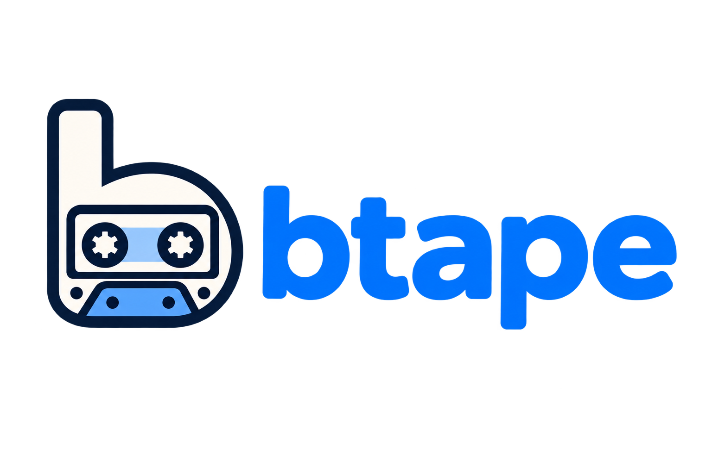

# btape

<p align="center">
  
</p>

`btape` is a small, VHS-inspired Ruby CLI that runs browser actions from a
`.tape` file and records them as an animated GIF. Ferrum controls Chromium
and captures PNG frames, and a pure-Ruby encoder produces the GIF. It
does not require Playwright, Selenium, ffmpeg, or an external service.

Tapes are written by hand, or asked of a language model running on the same
machine: `btape generate` describes the language to LM Studio, Ollama or
anything else speaking their API, and holds the answer to the parser before
handing it over.

## Commands

```text
Output <path>
Viewport <width>x<height>
Set <name> <value>
Goto <url>
Click <CSS selector or text=Text>
Type <CSS selector> <text>
Press <key> [count]
Frame <CSS selector or main>
Evaluate <javascript>
WaitFor <CSS selector or text=Text> [duration]
WaitForJS <javascript> [duration]
Screenshot [name]
Sleep <number>ms|s
```

Arguments containing spaces must be quoted. Empty lines and lines beginning
with `#` are ignored. `Output` is required; `Viewport` defaults to `1280x720`.
Output paths are resolved relative to the tape file.

```text
Output demo.gif
Viewport 1280x720
Goto http://localhost:3000
Click "text=Login"
Type "#email" "demo@example.com"
Sleep 1s
```

`Evaluate` runs JavaScript in the current frame, which is how a tape reaches
an API the page exposes rather than clicking at it. `Frame` points the
commands that follow at an iframe, and `Frame main` returns to the page;
navigating returns to the page too, since the frame belonged to the page that
was left. `WaitFor` and `WaitForJS` poll instead of guessing at a `Sleep`.

`Screenshot` captures a frame there and then. With a name it also lands at a
predictable path, for picking one particular frame out of a run.

## Settings

`Set NAME VALUE` configures a run. Every setting can also be given on the
command line with `--set NAME=VALUE`, which wins over the tape, so one tape
can run in more than one place.

| Name | Default | Meaning |
| --- | --- | --- |
| `WsUrl` | — | Connect to a browser already running at this CDP url instead of launching one |
| `CaptureMode` | `interval` | `interval` records continuously; `manual` captures only where `Screenshot` says to |
| `Framerate` | `10` | Captures per second in interval mode |
| `FrameDelay` | `100ms` | How long each frame is shown in the GIF |
| `Loop` | `0` | Times to loop; 0 is forever |
| `Scale` | `1.0` | Scale the output down |
| `OutputWidth` | — | Output width in pixels; overrides `Scale` and keeps the aspect ratio |
| `Quantizer` | `adaptive` | `adaptive` picks the palette from the frames; `rgb332` uses a fixed one |
| `Timeout` | `120s` | Give up on the whole run after this |
| `WaitTimeout` | `10s` | Give up on a `WaitFor` or `WaitForJS` after this |
| `WaitInterval` | `100ms` | How often those two check |
| `WaitStable` | `1` | How many checks in a row must pass before a wait is satisfied |
| `MaxFrames` | `600` | Stop rather than record a hung page until the disk fills |

## Install and run

Chromium must be installed and discoverable by Ferrum. Then:

```sh
bundle install
bundle exec btape demo.tape
bundle exec rake spec
```

```text
Usage: btape [options] SCRIPT.tape

  --ws-url URL     Connect to a browser already running at this CDP url
  --set NAME=VALUE Override a setting, as a Set line would
  --frames-dir DIR Write the PNG frames here and keep them
  --verbose        Report each command on stderr as it runs

Subcommands:
  generate DESCRIPTION  Write a tape by asking a local model; btape generate --help
```

`BTAPE_WS_URL` is used when neither `--ws-url` nor `--set WsUrl=` is given.

### Fonts, and text that is not Latin

Glyphs come from the fonts the browser can see, which is not necessarily the
machine btape runs on: the host when btape launches Chromium itself, the other
machine when `Set WsUrl` points at one, and the image when either of those is
a container. Nothing raises when a script has no coverage — the page records as
rows of tofu boxes instead — so a font missing from a headless image shows up
in the GIF and nowhere earlier.

Install fonts covering the scripts the tapes visit. On Debian or Ubuntu:

```sh
apt-get install fonts-noto-core                # most scripts, Latin included
apt-get install fonts-noto-cjk                 # Chinese, Japanese, Korean
apt-get install fonts-ipafont fonts-ipaexfont  # Japanese, as IPAGothic, IPAexGothic, IPAMincho
```

Fontconfig reads `/usr/share/fonts`, `/usr/local/share/fonts`,
`~/.local/share/fonts` and `~/.fonts`, and font files copied in by hand need
an `fc-cache -f` after them. The home directory in that list is the one
belonging to whoever launches the browser, which under a service manager is
often not the user who installed the font — `sudo -u deploy fc-list` settles
that faster than another recording does. Chromium reads the configuration as
it starts, and btape starts one browser per run; a browser shared over `WsUrl`
keeps the fonts it was launched with until it is restarted.

Where one installed font covers a script, that is the whole job: the browser
falls back to it even for a page that asked for `sans-serif`. Naming a family
matters when several cover the same script — Noto CJK and IPA together, or a
developer's macOS with Hiragino already on it. Either force it from the tape:

```text
Evaluate "document.head.insertAdjacentHTML('beforeend', '<style>*{font-family:IPAexGothic!important}</style>')"
```

which lasts as long as the document it ran in, so it is repeated after each
`Goto` and inside a `Frame`; or prefer it for everything the machine renders,
in `/etc/fonts/local.conf`:

```xml
<?xml version="1.0"?>
<!DOCTYPE fontconfig SYSTEM "fonts.dtd">
<fontconfig>
  <alias><family>sans-serif</family><prefer><family>IPAexGothic</family></prefer></alias>
  <alias><family>serif</family><prefer><family>IPAexMincho</family></prefer></alias>
  <alias><family>monospace</family><prefer><family>IPAGothic</family></prefer></alias>
</fontconfig>
```

An alias only answers for the generic families. A page naming `Helvetica,
Arial` ahead of `sans-serif` keeps whatever those resolve to — Liberation Sans,
in an image that has it — so such a page is served by forcing the family from
the tape, or by matching those names in the fontconfig file as well. macOS has
no fontconfig at all, and there the tape is the only route.

A tape can check that the font arrived rather than trust the image it runs in,
since a family that is not installed measures the same as one that does not
exist:

```text
WaitForJS "(() => { const c = document.createElement('canvas').getContext('2d'); const w = (f) => { c.font = '48px ' + f; return c.measureText('AあÄ0').width; }; return w('IPAexGothic') !== w('__missing__'); })()" 3s
```

Tape files themselves are read as UTF-8 whatever the locale says, so a `Type`
line or a `text=` selector can be written in any script.

### A browser running somewhere else

btape launches its own Chromium by default. Point it at one that is already
running — a `browserless`/`chrome` container, say — and no browser needs to be
in the image btape runs from:

```sh
btape --ws-url ws://chrome:3000 examples/thumbnails.tape
```

Each connection gets its own browser context, so concurrent runs against one
shared browser do not see each other. The viewport is applied over the wire,
since a browser that is already running cannot be told its window size at
launch.

### Frames, not just the GIF

Frames are normally written to a temporary directory and removed as the run
unwinds. `--frames-dir` keeps them:

```sh
btape --frames-dir frames examples/thumbnails.tape
```

## Writing a tape with a local model

`btape generate` describes the language to a model running on your own
machine and asks it for a tape:

```sh
btape generate "record signing in at localhost:3000 and landing on the dashboard" -o signin.tape
btape signin.tape
```

The default is `http://localhost:1234/v1`, which is where LM Studio serves.
Anything else speaking the same API answers just as well — Ollama on
`http://localhost:11434/v1`, llama.cpp's server, vLLM — so nothing about the
description or the page being recorded leaves the machine unless you point
`--llm-url` somewhere that it does.

```text
Usage: btape generate [options] DESCRIPTION

  --llm-url URL    The OpenAI-compatible model server to ask
  --model NAME     Ask for this model rather than whichever one is loaded
  --temperature N  How freely the model writes; 0.2 by default
  --context FILE   Give the model this file as context: selectors, notes, markup
  -o, --out FILE   Write the tape here rather than to standard output
  --verbose        Report each attempt on stderr
```

`BTAPE_LLM_URL`, `BTAPE_LLM_MODEL` and `BTAPE_LLM_KEY` stand in for the first
two flags and for a key, which a local server rarely wants and a proxy in
front of one usually does. With no model named, the server is asked which one
it has loaded — the name a download was given is not worth remembering.

The description can be piped in rather than quoted, which is easier for
anything longer than a line:

```sh
btape generate --context app/views/sessions/new.html.erb < what-to-record.txt
```

What comes back is parsed before you see it, and a tape that does not parse
goes back to the model with the parser's own complaint — `line 4: unknown
command "Navigate"` — for it to fix, up to three times. That loop is why this
is worth more than pasting the command list into a chat window: a small model
reliably invents a command or drops a quote, and just as reliably repairs it
when told which line. What it cannot know is your markup, so a tape it wrote
still names selectors that have to be checked against the page. Read it before
you run it, the way you would read anything else generated for you.

### A model that is not on this machine

`--llm-url` is the whole of the configuration, so a hosted endpoint speaking
the same API works as well as a local one. Name the model rather than leaving
it to be discovered: these servers answer `/v1/models` with a catalogue rather
than with the one thing they have loaded, and the first entry of it is not
necessarily something that holds a conversation.

```sh
BTAPE_LLM_KEY=sk-... btape generate --llm-url https://api.openai.com/v1 --model gpt-4.1 "record signing in"
```

Anthropic serves an OpenAI-compatible layer on the same host as its own API,
so `--llm-url https://api.anthropic.com/v1 --model claude-opus-5` records too.
It is meant for trying models rather than for living on, but nothing btape
asks of it is among the parts that are missing. A model that refuses
`--temperature` at anything but its default wants `--temperature 1`.

Sending the work somewhere else is the thing to weigh, not the flag. A local
model keeps the description and the `--context` file on the machine that ran
the command; a hosted one is handed both, and a context file is usually a page
of your own markup rather than something you would have published.

## From Ruby

`Runner#run` returns a `Btape::Result`:

```ruby
commands = Btape::Parser.new.parse(File.read('deck.tape'))

result = Btape::Runner.new(logger: Rails.logger).run(
  commands,
  base_directory: File.dirname('deck.tape'),
  settings: { ws_url: ENV['CHROME_WS_URL'] },
  frames_directory: frames,
  on_frame: ->(path, index) { logger.debug("captured #{index}: #{path}") }
)

result.output_path            # where the GIF went
result.frame_count            # frames that went into it
result.frame_paths            # the frames, when frames_directory was given
result.named_frames['page-01'] # the frame a Screenshot named
```

Nothing has to touch the filesystem. Pass an IO to write the GIF into:

```ruby
buffer = StringIO.new(+''.b)
Btape::Runner.new.run(commands, base_directory: '.', output: buffer)

# `buffer.string` is the GIF. Hand it to whatever holds on to it — an Active
# Storage attachment on one of your own records, say:
deck = Deck.find(params[:id])
deck.animation.attach(io: StringIO.new(buffer.string), filename: 'deck.gif')
```

or use the encoder on its own, with PNG paths or ChunkyPNG images:

```ruby
Btape::GifEncoder.new(delay: 150, width: 640).encode(frame_paths) # => String
```

The generator is a plain object too, so an application that already knows what
it wants recorded can go from a sentence to a GIF without a file in between:

```ruby
generator = Btape::LLM::Generator.new(client: Btape::LLM::Client.new(base_url: ENV['BTAPE_LLM_URL']))
tape = generator.call('record the dashboard loading', context: page_markup)

Btape::Runner.new.run(Btape::Parser.new.parse(tape), base_directory: '.', output: buffer)
```

## Container development with dip or wip

The development image contains Ruby, Chromium and Latin fonts; tapes that
record other scripts need fonts for them added to it.

```sh
dip provision
dip test
dip demo

wip up
wip dispatch demo
wip dispatch btape examples/demo.tape
```

`examples/demo.tape` drives a small static page bundled at
`examples/demo_app.html`, so the demo is self-contained and needs no other
service running. Edit the tape (or point `Goto` at a different URL) to record
something else. `examples/thumbnails.tape` shows the other shape of run: one
frame per page of a deck, against a browser running elsewhere.

## Limitations

The palette is chosen from the frames being encoded, which tracks gradients
and text edges far more closely than the fixed RGB332 palette earlier versions
used — but banding compresses well and fidelity does not, so the files are
larger than they were. `Set Scale` or `Set OutputWidth` are the levers to pull
back; identical consecutive frames are already collapsed into one held for
longer. `Set Quantizer rgb332` restores the old palette.

The first matching element is used for `Click` and `Type`.

## Upgrading to 0.2

`Runner#run` returns a `Btape::Result` rather than the output path. Read
`result.output_path` where the path was used before.

## Contributing

Bug reports and pull requests are welcome. See [CONTRIBUTING.md](CONTRIBUTING.md)
for the development setup, PR conventions, and how releases are generated.
This project follows the [Code of Conduct](CODE_OF_CONDUCT.md).

## License

[MIT](LICENSE)
